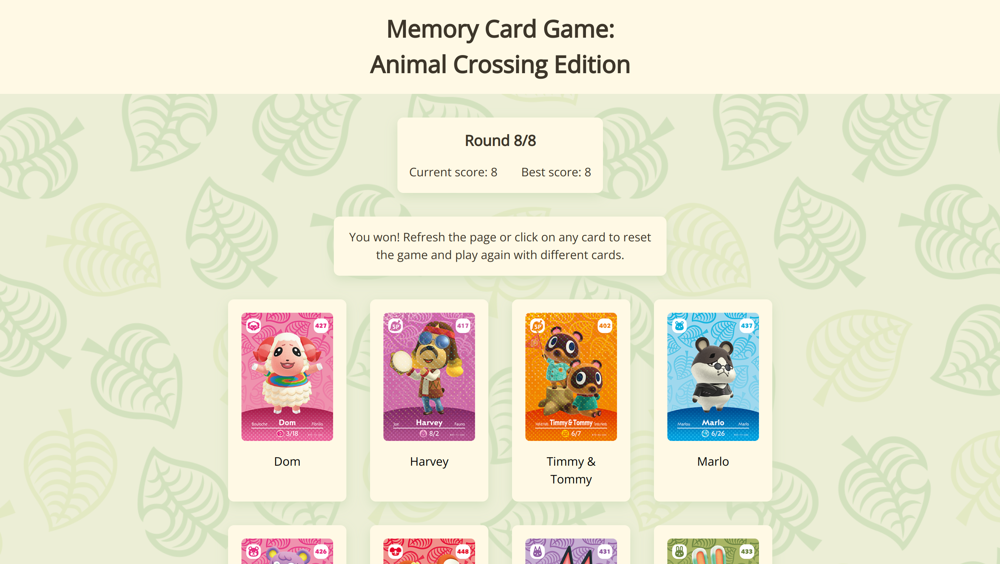
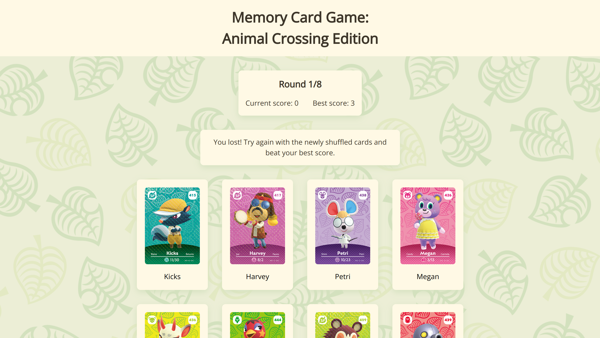

# Memory Card Game: Animal Crossing Edition

https://memory-card-ehz.pages.dev/

## Project Summary

This project exercise, created by The Odin Project, is a simple memory card game to practice working with hooks to manage state and side effects while fetching and using data from an API.

## Features Overview

Demo:

### How to Play

#### <ins>The Rules</ins>

This is a simple memory card game that tests your ability to remember and select different cards each round. To play, click on a card that has not been selected yet. If your memory serves you right, the cards will shuffle and you get to play again until all 8 cards are selected. If you select a previously selected card, the game ends!

#### <ins>What Happens When You Win</ins>

Congratulations! To start a new game, choose any of the two options:

1. Refresh the page.
2. Click on any card.

Both methods will reset the round and scoreboard as well as display new cards.

#### <ins>What Happens When You Lose</ins>

When you click on a card that has already been selected, the cards will shuffle and both the round number and current score will reset to their default value. The cards remain the same until you select all 8 cards! To continue playing, click on any card and try and beat your best score.

## Reflection

After completing this project, I found myself getting the hang of working in a React environment and using state and effect hooks. This is only my second time working with APIs, so I learned more about using `try/catch` blocks and the process of retrieving data that may or may not contain `null/undefined` values. It's important to consider that some data is sparse. Although this is my second time working with APIs, it is my first project working with APIs in React. I implemented the `AbortController` Web API to handle React's strict mode from producing multiple API calls. My research at the time led me to believe this was an effective solution, but I may find another solution as I progress through the React curriculum. Moving forward, I definitely plan to look into creating my own custom hooks and components to create cleaner code. This was not a major objective for this project since I am still getting used to working with React and the React workflow.

## Credits

- Favicon icon by Vitaly Gorbachev on [Freepik](https://www.freepik.com/icon/cards_4591489#fromView=search&term=card+game&page=1&position=82&track=ais&uuid=99a976a6-c469-4049-b786-e315c1c7e1ba)
- Animal Crossing background image by jotaauvei on [DeviantArt](https://www.deviantart.com/jotaauvei/art/Nook-Inc-Wallpaper-Summer-Collection-827180686)
- Amiibo API by [Nevin Vu](https://amiiboapi.com/)
